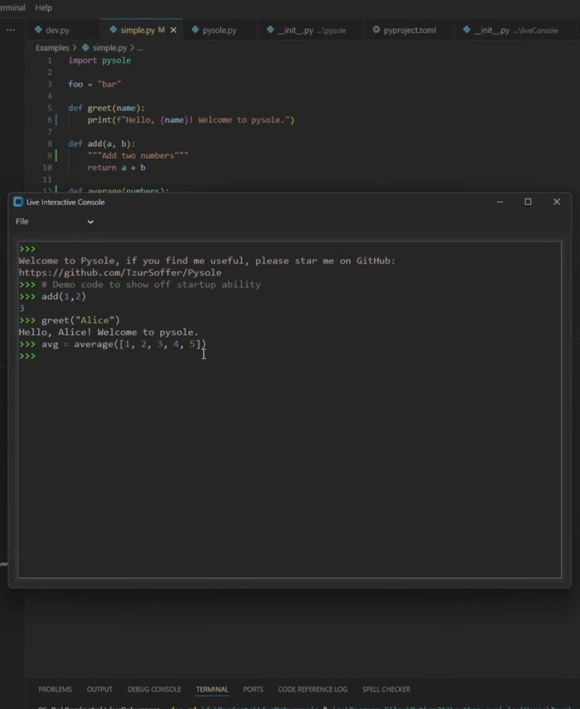

# PYSOLE

## You can finally test your code in real time without using idle!
### If you found [this repository](https://github.com/TzurSoffer/Pysole) useful, please give it a ⭐!.

## Showcase (click to watch on Youtube)
[](https://www.youtube.com/shorts/pjoelNjc3O0)

A fully-featured, **live Python console GUI** built with **CustomTkinter** and **Tkinter**, featuring:

*   Python syntax highlighting via **Pygments**
    
*   Autocomplete for **keywords, built-ins, and local/global variables**

*   Run code at startup for easier debugging
    
*   Thread-safe execution of Python code
    
*   Output capturing for `stdout` and `stderr`
    
*   Multi-line input with auto-indentation
    
*   History of previous commands

* **Integrated Help Panel** for quick access to Python object documentation


## Installation

`pip install liveConsole`


## Features

### Standalone Launch

* Once installed, you can launch the console directly by simply typing  ```pysole``` or ```liveconsole``` in the terminal

* This opens the full GUI without needing to write any code. Perfect for quick debugging and experimenting.

### Syntax Highlighting

*   Real-time syntax highlighting using **Pygments** and the **Monokai** style.
    
*   Highlights Python keywords, built-ins, and expressions in the console.
    
### Run Code at Startup

*   Pysole can automatically execute Python code when the console launches.

*   Use the runRemainingCode=True argument in pysole.probe() to run all remaining lines in the calling script after the probe() call.

*   The printStartupCode flag controls whether these lines are printed in the console as they execute (True) or run silently (False).

*   Useful for initializing variables, importing libraries, or setting up your environment automatically.

### Autocomplete

*   Suggests **keywords**, **built-in functions**, and **variables** in scope.
    
*   Popup list appears after typing at least 2 characters.
    
*   Only inserts the **missing portion** of a word.
    
*   Navigate suggestions with **Up/Down arrows**, confirm with **Tab/Return**.
    

### Multi-Line Input

*   Supports **Shift+Enter** for inserting a new line with proper indentation.
    
*   Automatically detects incomplete statements and continues the prompt.
    

### Thread-Safe Execution

*   Executes user code in a separate thread to prevent GUI freezing.
    
*   Captures both `stdout` and `stderr` output and prints them in the console.
    
*   Supports both **expressions (`eval`)** and **statements (`exec`)**.
    

### Clickable History

*   Hover previous commands to see them highlighted.
    
*   Click to copy them back to the prompt for editing or re-execution.
    

### Help Panel

*   A resizable right-hand panel that displays Python documentation (help()) for any object.

*   Opens when clicking ctrl+click on a function/method and can be closed with the "X" button.

*   Scrollable and syntax-styled.

*   Perfect for quick reference without leaving the console.


### Easy Integration

*   Automatically grabs **caller frame globals and locals** if not provided.
    
*   Can be used standalone or embedded in larger CustomTkinter applications.

## Usage

```
import pysole
pysole.probe()
```
or for also running some code at the startup of the pysole
```
import pysole
pysole.probe(runRemainingCode=True,   #< for executing the code below probe
             printStartupCode=True    #< for printing the command as well as it output
             )
x = 1                                 #< initialize some variable
print(x)                              #< print the variable on the console
```

*   Type Python commands in the `>>>` prompt and see live output.

## Keyboard Shortcuts

| Key | Action |
| --- | --- |
| `Enter` | Execute command (if complete) |
| `Shift+Enter` | Insert newline with auto-indent |
| `Tab` | Complete the current word / show suggestions |
| `Up/Down` | Navigate suggestion list |
| `Escape` | Hide suggestions |
| `Mouse Click` | Select previous command from history |


## Customization

*   **Appearance mode**: Dark mode is default, but can be changed via files menu

*   **Themes**: Pysole has multiple preconfigured themes. You can choose a theme via the Theme Picker, which updates the console colors and appearance. Preconfigured themes are loaded from themes.json and the selected theme is saved in settings.json so it persists across sessions.


## License

MIT License – free to use, modify, and distribute.
